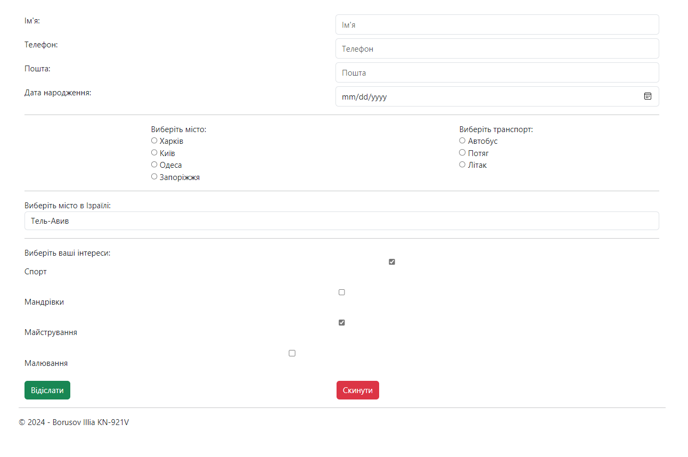

# Lab 2 - Варіант 2

## Вид форми 

## Task 1 Простий Request

```cshtml 
@if (IsPost)
{
    <div class="container mt-5">
        <h4>Дані, введені в форму:</h4>
        <p>Ім'я: @Request.Form["Name"]</p>
        <p>Телефон: @Request.Form["Phone"]</p>
        <p>Пошта: @Request.Form["Email"]</p>
        <p>Дата народження: @Request.Form["DOB"]</p>
        <p>Місто: @Request.Form["city"]</p>
        <p>Місто Ізраіля: @Request.Form["city_israel"]</p>
        <p>Транспорт: @Request.Form["transport"]</p>
        <p>Інтереси: @((Request.Form.GetValues("interests") != null) ? string.Join(", ", Request.Form.GetValues("interests")) : "Нічого не вибрано")</p>
    </div>
}

```

Тобто просто  виводимо дані з форми по реквесту.

## Task 2 iFormCollection

```cshtml
@if (IsPost)
{
    var form = HttpContext.Current.Request.Form;
    <div class="container mt-5">
        <h4>Дані, введені в форму:</h4>
        <p>Ім'я: @form["Name"]</p>
        <p>Телефон: @form["Phone"]</p>
        <p>Пошта: @form["Email"]</p>
        <p>Дата народження: @form["DOB"]</p>
        <p>Місто: @form["city"]</p>
        <p>Місто Ізраіля: @form["city_israel"]</p>

        <p>Транспорт: @form["transport"]</p>
        <p>Інтереси: @string.Join(", ", form["interests"].ToArray())</p>
    </div>
}

```

## Task 3 слабка типізація

```cs
    using System;
    using System.ComponentModel.DataAnnotations;

    namespace Lab_02
    {
        public class ModelHome
        {
            [Required(ErrorMessage = "Ім'я обов'язкове поле")]
            public string Name { get; set; }

            [Required(ErrorMessage = "Телефон обов'язкове поле")]
            public string Phone { get; set; }

            [Required(ErrorMessage = "Пошта обов'язкове поле")]
            [EmailAddress(ErrorMessage = "Введіть коректну адресу електронної пошти")]
            public string Email { get; set; }

            [Required(ErrorMessage = "Дата народження обов'язкове поле")]
            public DateTime DOB { get; set; }
        }
    }

```


## Task 4-5 Строга типізація

```cs
using System;
using System.ComponentModel.DataAnnotations;

namespace Lab_02
{
    public class ModelHome
    {
        [Required(ErrorMessage = "Ім'я обов'язкове поле")]
        public string Name { get; set; }

        [Required(ErrorMessage = "Телефон обов'язкове поле")]
        public string Phone { get; set; }

        [Required(ErrorMessage = "Пошта обов'язкове поле")]
        [EmailAddress(ErrorMessage = "Введіть коректну адресу електронної пошти")]
        public string Email { get; set; }

        [Required(ErrorMessage = "Дата народження обов'язкове поле")]
        public DateTime DOB { get; set; }

        [Required(ErrorMessage = "Виберіть місто")]
        public string City { get; set; }

        [Required(ErrorMessage = "Виберіть місто в Ізраїлі")]
        public string CityIsrael { get; set; }

        [Required(ErrorMessage = "Виберіть транспорт")]
        public string Transport { get; set; }

        [Required(ErrorMessage = "Виберіть хоча б один інтерес")]
        public string[] Interests { get; set; }
    }
}


```


