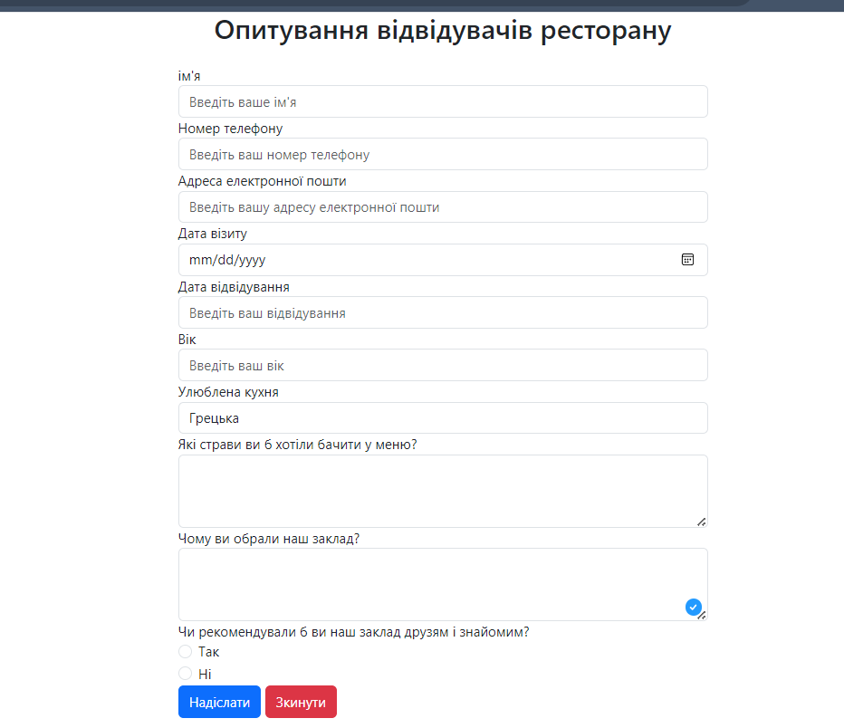
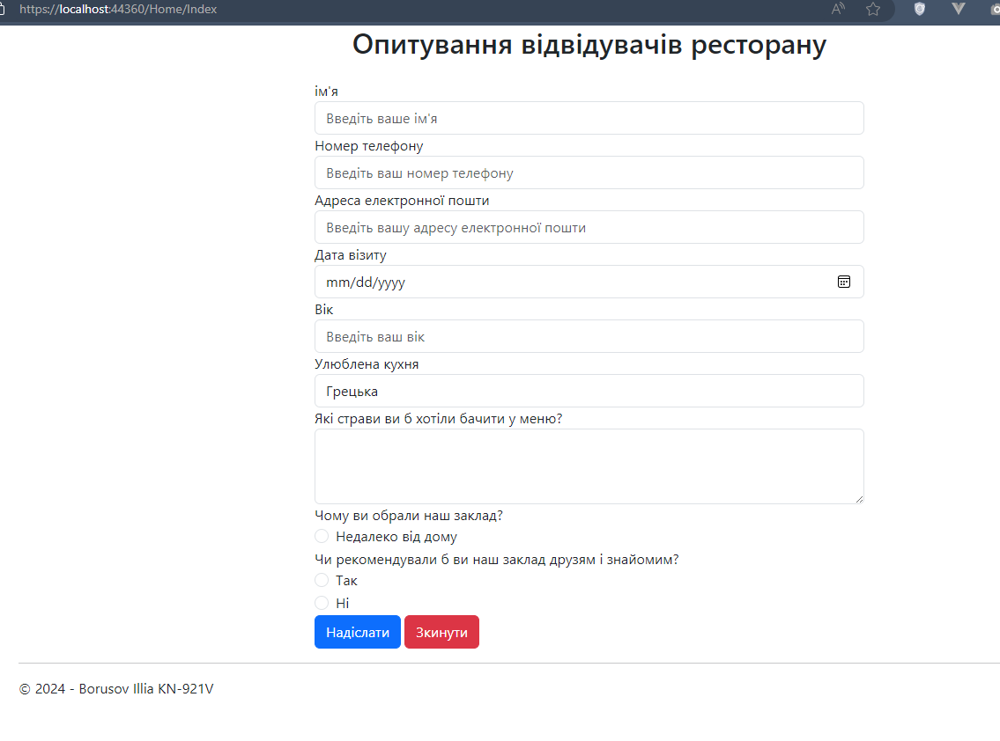
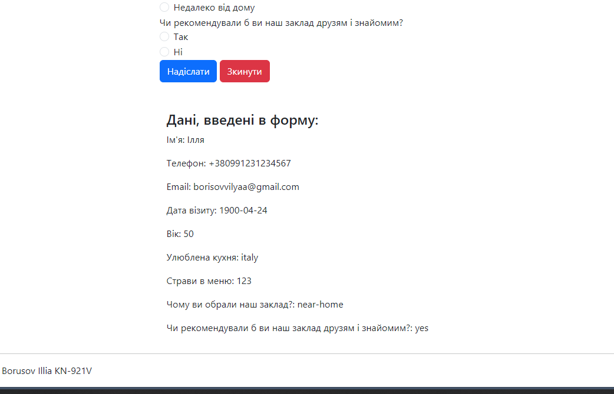
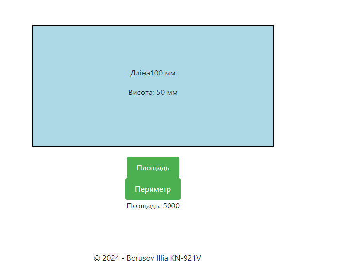
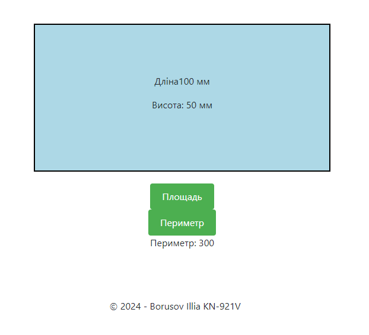

# Lab 3 - Варіант 2

## Вид форми 



## Task 1 

1. Було створенно форму та зрбоблено вивід через Request





2. Створено колекцію

```cs
var formData = new FormData
{
    Name = Request.Form["it-s"],
    Phone = Request.Form["phone"],
    Email = Request.Form["email"],
    VisitDate = DateTime.Parse(Request.Form["date"]),
    Age = int.Parse(Request.Form["years"]),
    FavoriteCuisine = Request.Form["favorite-cuisine"],
    MenuItems = Request.Form["menu-items"],
    ReasonForChoosing = Request.Form["reason"],
    RecommendToOthers = Request.Form["recommend"] == "yes"
};

```

3. Створенно слабку та строгу типізацію

```cs

using System;
using System.ComponentModel.DataAnnotations; // Для атрибутів валідації

public class FormData
{
    [Required(ErrorMessage = "Поле 'Ім'я' обов'язкове для заповнення.")]
    public string Name { get; set; }

    [Required(ErrorMessage = "Поле 'Номер телефону' обов'язкове для заповнення.")]
    [DataType(DataType.PhoneNumber, ErrorMessage = "Некоректний формат номеру телефону.")]
    public string Phone { get; set; }

    [Required(ErrorMessage = "Поле 'Email' обов'язкове для заповнення.")]
    [EmailAddress(ErrorMessage = "Некоректний формат email адреси.")]
    public string Email { get; set; }

    [Required(ErrorMessage = "Поле 'Дата візиту' обов'язкове для заповнення.")]
    [DataType(DataType.Date, ErrorMessage = "Некоректний формат дати.")]
    public DateTime VisitDate { get; set; }

    [Range(0, 100, ErrorMessage = "Некоректний вік.")]
    public int? Age { get; set; }

    [Required(ErrorMessage = "Поле 'Улюблена кухня' обов'язкове для заповнення.")]
    public string FavoriteCuisine { get; set; }

    [Required(ErrorMessage = "Поле 'Страви в меню' обов'язкове для заповнення.")]
    public string MenuItems { get; set; }

    [Required(ErrorMessage = "Поле 'Чому ви обрали наш заклад?' обов'язкове для заповнення.")]
    public string ReasonForChoosing { get; set; }

    [Required(ErrorMessage = "Поле 'Чи рекомендували б ви наш заклад друзям і знайомим?' обов'язкове для заповнення.")]
    public bool? RecommendToOthers { get; set; }
}

```


4. Створенно програму, яка розраховує периметр та площу прямокутника з сторонами 100 на 50



