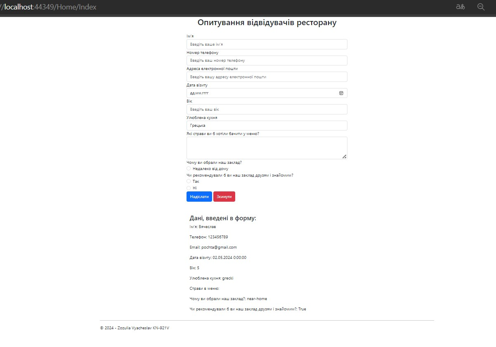

# Lab 4 - Варіант 4

## Task 1
```cshtml
@{
    ViewBag.Title = "Home Page";
}

<div class="container">
    <div class="row justify-content-center">
        <div class="col-md-6">
            <h2 class="text-center mb-4">Опитування відвідувачів ресторану</h2>
            <form method="post">
                <div class="form-group">
                    <label for="it-s">Ім'я</label>
                    <input type="text" class="form-control" id="it-s" name="it-s" placeholder="Введіть ваше ім'я">
                </div>
                <div class="form-group">
                    <label for="phone">Номер телефону</label>
                    <input type="tel" class="form-control" id="phone" name="phone" placeholder="Введіть ваш номер телефону">
                </div>
                <div class="form-group">
                    <label for="email">Адреса електронної пошти</label>
                    <input type="email" class="form-control" id="email" name="email" placeholder="Введіть вашу адресу електронної пошти">
                </div>
                <div class="form-group">
                    <label for="date">Дата візиту</label>
                    <input type="date" class="form-control" id="date" name="date">
                </div>
                <div class="form-group">
                    <label for="years">Вік</label>
                    <input type="text" class="form-control" id="years" name="years" placeholder="Введіть ваш вік">
                </div>
                <div class="form-group">
                    <label for="favorite-cuisine">Улюблена кухня</label>
                    <select class="form-control" id="favorite-cuisine" name="favorite-cuisine">
                        <option value="grecki">Грецька</option>
                        <option value="ukraine">Українська</option>
                        <option value="italy">Італійська</option>

                    </select>
                </div>
                <div class="form-group">
                    <label for="menu-items">Які страви ви б хотіли бачити у меню?</label>
                    <textarea class="form-control" id="menu-items" name="menu-items" rows="3"></textarea>
                </div>
                <div class="form-group">
                    <label for="reason">Чому ви обрали наш заклад?</label>
                    <div class="form-check">
                        <input class="form-check-input" type="radio" name="reason" id="near-home" value="near-home">
                        <label class="form-check-label" for="near-home">
                            Недалеко від дому
                        </label>
                    </div>
                </div>
                <div class="form-group">
                    <label for="recommend">Чи рекомендували б ви наш заклад друзям і знайомим?</label>
                    <div class="form-check">
                        <input class="form-check-input" type="radio" name="recommend" id="yes" value="yes">
                        <label class="form-check-label" for="yes">
                            Так
                        </label>
                    </div>
                    <div class="form-check">
                        <input class="form-check-input" type="radio" name="recommend" id="no" value="no">
                        <label class="form-check-label" for="no">
                            Ні
                        </label>
                    </div>
                </div>
                <button type="submit" class="btn btn-primary">Надіслати</button>
                <button type="reset" class="btn btn-danger">Зкинути</button>
            </form>

            @if (IsPost)
            {
                var form = HttpContext.Current.Request.Form;
                <div class="container mt-5">
                    <h4>Дані, введені в форму:</h4>
                    <p>Ім'я: @form["it-s"]</p>
                    <p>Телефон: @form["phone"]</p>
                    <p>Email: @form["email"]</p>
                    <p>Дата візиту: @form["date"]</p>
                    <p>Вік: @form["years"]</p>
                    <p>Улюблена кухня: @form["favorite-cuisine"]</p>
                    <p>Страви в меню: @form["menu-items"]</p>
                    <p>Чому ви обрали наш заклад?: @form["reason"]</p>
                    <p>Чи рекомендували б ви наш заклад друзям і знайомим?: @form["recommend"]</p>
                </div>
            }
        </div>
    </div>
</div>

```

## Task 2



## Task 3


## Task 4-5

